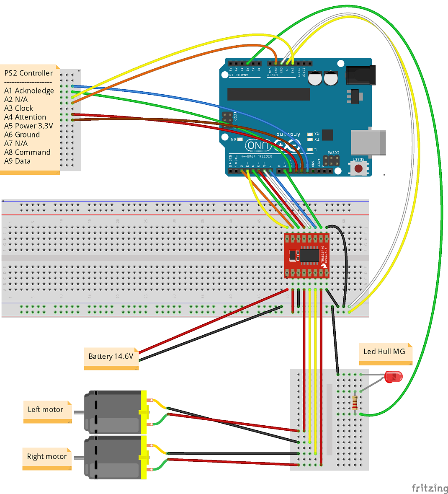

# arduino-panzer

Because buying one was too easy, better build and program it yourself!

This project aims to control a RC tank using a programmable board, arduino, and implement the main features of other commercial products such as Heng Long, Toro or Taigen: classic movement, turret rotation, gun elevation, sound, smoke, lights etc.

## Parts

Currently I have a heng long chassis with gearbox (2 DC motors), turret rotation gearbox, airsoft gun unit, sound unit and smoke generator. I control it with a bluetooth ps2 controller and several TB6612FNG drivers. See the wiring-diagram for more details.

Hardware:

* 1 x Arduino mega.
* 3 x TB6612FNG.
* 1 x Heng Long chassis with gearbox (2 DC motors).
* 1 x Turret rotation gearbox.
* 1 x Airsoft gun unit.
* 1 x Dasmikro TBS Mini sound unit.
* 1 x 8 Ohm speaker.
* 1 x PS2 controller (bluetooth is not necessary).
* 1 x battery (I'm using a 14.5V 2.15Ah from a robot vacuum cleaner).
* 1 x 9V battery for arduino standalone power.
* A lot of jumper wires.

## Dependencies

* [DifferentialSteering](https://github.com/edumardo/DifferentialSteering)
* [PS2X_lib](https://github.com/madsci1016/Arduino-PS2X)
* [arduino-timer](https://github.com/contrem/arduino-timer)

## Features

| Feature                       | Status         | Description |
|-------------------------------|----------------|-------------|
| PS2 Pad control               | ✔️ Done        |            |
| PS2 left analog stick control | ✔️ Done        |            |
| Turret rotation               | ✔️ Done        |            |
| Gun elevation                 | ✔️ Done        |            |
| Airsoft gun shoot             | ⚙️ In progress |            |
| Smoke unit                    | ✔️ Done        |            |
| Sound unit                    | ⚙️ In progress |            |
| Start / Stop sequence         | ⚙️ In progress |            |
| Hull MG firing sound          | ⚙️ In progress |            |
| Hull MG firing led            | ⚠️ Pending     |            |

## Wiring diagram

## Arduino Mega Timers, PWMs and Servos

PWMs:

|Registrer | Pin        | Timer  | Frequency | PWM Freq | Prescaler (* default)         |
|-------   |----------- |--------|-----------|----------|-------------------------------|
|TCCR0B    | 4, 13      | Timer0 | 62500 Hz  | 980 Hz   | 1, 8, 64*, 256, 1024          |
|TCCR1B    | 11, 12     | Timer1 | 31250 Hz  | 490 Hz   | 1, 8, 64*, 256, 1024          |
|TCCR2B    | 9, 10      | Timer2 | 31250 Hz  | 490 Hz   | 1, 8, 32, 64*, 128, 256, 1024 |
|TCCR3B    | 2, 3, 5    | Timer3 | 31250 Hz  | 490 Hz   | 1, 8, 64*, 256, 1024          |
|TCCR4B    | 6, 7, 8    | Timer4 | 31250 Hz  | 490 Hz   | 1, 8, 64*, 256, 1024          |
|TCCR5B    | 44, 45, 46 | Timer5 | 31250 Hz  | 490 Hz   | 1, 8, 64*, 256, 1024          |

[Servo](https://www.arduino.cc/reference/en/libraries/servo/) library:

| Nº Servos | Timer      | Lost PWMs                   |
|-----------|---------   |-----------------------------|
| < 12      | 5          | 44, 45, 46                  |
| <= 24     | 1, 5       | 11, 12, 44, 45, 46          |
| <= 36     | 1, 3, 5    | 2, 3, 5, 11, 12, 44, 45, 46 |
| <= 48     | 1, 3, 4, 5 | All                         |
