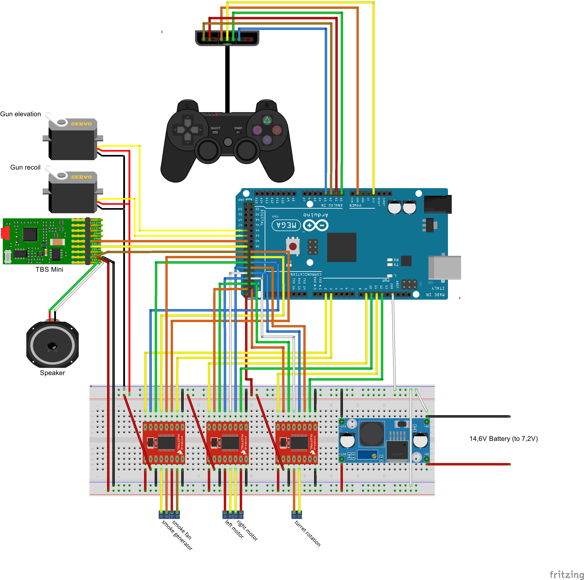

# arduino-panzer

Because buying one was too easy, better build and program it yourself!

This project aims to control a RC tank using a programmable board, arduino, and implement the main features of other commercial products such as Heng Long, Toro or Taigen: classic movement, turret rotation, gun elevation, sound, smoke, lights etc.

## Parts

Currently I have a heng long chassis with gearbox (2 DC motors), and I control it with a bluetooth ps2 controller and a TB6612FNG driver. See the wiring-diagram for more details.

Hardware:

* 1 x Arduino uno.
* 1 x TB6612FNG.
* 1 x Heng Long chassis with gearbox (2 DC motors).
* 1 x PS2 controller (bluetooth is not necessary).
* 1 x battery (I'm using a 14.5V 2.15Ah from a robot vacuum cleaner).
* 1 x 9V battery for arduino standalone power.
* A lot of jumper wires.

## Dependencies

* [DifferentialSteering](https://github.com/edumardo/DifferentialSteering)
* [PS2X_lib](https://github.com/madsci1016/Arduino-PS2X)

## Features

| Feature | Status | Description |
|---------|-------------|--------|
| PS2 Pad control | ✔️ Done | |
| PS2 left analog stick control | ✔️ Done | |
| Turret rotation | ⚠️🛰 Pending hardware | |
| Gun elevation | ⚠️🛰 Pending hardware | |
| Smoke unit | ⚠️ Pending | |
| Sounds | ⚠️ Pending | |
| Hull MG firing sound | ⚠️ Pending | |
| Hull MG firing led | ⚠️ Pending | |

## Wiring diagram

